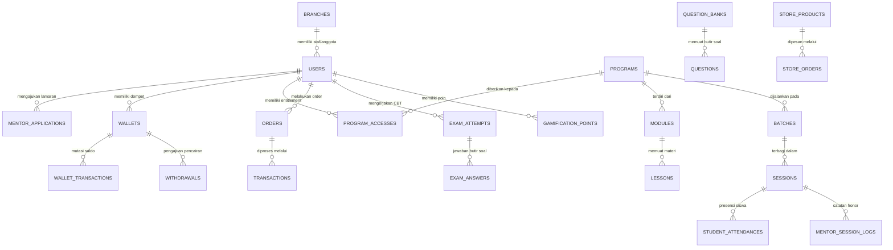

# Product Requirements Document (PRD)

# Ekosistem dan Mekanisme Baru Platform Arkanin (AMS, ASA, ASD, A-Plus, A-Teams)

| Informasi | Nilai |
| --- | --- |
| **Project** | Arkanin Education Platform |
| **Target Host/Domain** | `lms.arkanin.my.id` (Aplikasi), `arkanin.my.id` (Domain Induk) |
| **Versi PRD** | 1.0 |
| **Tanggal Terbit** | 21 September 2026 |
| **Status** | Disetujui (Approved) |
| **Penyusun** | Tim Produk & Rekayasa Perangkat Lunak Arkanin |
| **Referensi Konsep** | [new-concept.md](file:///d:/project/ams/docs/new-concept.md) & [2026-08-20-PRD-refactor-programs-workspace.md](file:///d:/project/ams/docs/plans/2026-08-20-PRD-refactor-programs-workspace.md) |

---

## 1. Executive Summary

### 1.1 Problem Statement
Infrastruktur pembelajaran dan operasional cabang saat ini mengalami fragmentasi akibat belum adanya satu gerbang terpadu (single portal) yang melayani seluruh persona, proses onboarding calon mentor yang belum memiliki pipeline seleksi terverifikasi, ketiadaan mekanisme penampungan dana pengembalian (refund) otomatis yang fleksibel, serta terpisahnya pencatatan honor mengajar dan gamifikasi belajar siswa. Akibatnya, tim cabang dan pusat harus melakukan verifikasi manual berulang, rekonsiliasi kas rawan selisih, dan retensi motivasi belajar siswa belum optimal.

### 1.2 Proposed Solution
Arkanin mengimplementasikan arsitektur ekosistem terpadu satu pintu masuk (`lms.arkanin.my.id`) dengan pengalihan tampilan berbasis peran dinamis (*Role-Based Dynamic Redirection*). Sistem memisahkan secara tegas namun terintegrasi antara:
1. **Area Management (Back-Office Dashboard)**: Super Admin melalui AMS (*Arkanin Management System*), serta Tim Cabang melalui ASA (*Arkanin Super App*) untuk operasional dan ASD (*Arkanin Super Diamond*) untuk keuangan.
2. **Area Public & User (Front-End & Workspace)**: Siswa melalui Workspace A-Plus (A+), Pengajar melalui Workspace A-Teams, dan publik/member melalui Katalog serta Store.
3. **Dual-Wallet Engine**: Mesin dompet terpisah untuk penampungan dana *refund/rollback* siswa dan akumulasi honor per sesi bagi mentor dengan pengamanan PIN transaksi.
4. **Ekosistem Gamifikasi & Store Reward**: Konversi pencapaian CBT 5 jenis pertanyaan menjadi poin untuk ditukarkan dengan produk fisik (buku/merchandise) di Store.
5. **Multi-Branch Isolation (`branch_id`)**: Isolasi data operasional dan keuangan antar-cabang dengan konsolidasi penuh di level pusat (AMS).

### 1.3 Success Criteria (Measurable KPIs)
1. **Onboarding to Workspace Speed**: Aktivasi akses ke Workspace siswa berlangsung $\le 3$ menit secara otomatis setelah transaksi diverifikasi/disetujui.
2. **Zero Cash Discrepancy on Refunds**: 100% dana transaksi yang dibatalkan (*reject/cancel*) dialokasikan seketika ke Saldo Akun Siswa (*Student Wallet*) tanpa selisih pembukuan.
3. **Mentor Payout SLA**: Waktu perhitungan dan pencairan honor mengajar mentor selesai dalam $< 24$ jam kerja pasca sesi kelas divalidasi.
4. **Learning Engagement & Funnel Conversion**: Peningkatan penyelesaian paket latihan/TryOut CBT sebesar $\ge 35\%$ yang terdorong oleh gamifikasi koin dan penukaran produk di Store.
5. **Data Isolation & Tenant Security**: 0 (*zero*) insiden kebocoran data antar-cabang melalui penegakan *Global Scope* `branch_id` pada level database backend.

---

## 2. User Experience & Functionality

### 2.1 User Personas & Hak Akses

```text
                               ┌─────────────────────────┐
                               │    lms.arkanin.my.id    │
                               └────────────┬────────────┘
                                            │
                            ┌───────────────┴───────────────┐
                            ▼                               ▼
                [ Area Public & User ]            [ Area Management ]
                (Front-End / Workspace)           (Back-Office Dashboard)
                            │                               │
                ┌───────────┼───────────┐         ┌─────────┴─────────┐
                ▼           ▼           ▼         ▼                   ▼
             Student     Mentor      Mentor    Super Admin       Admin Cabang
            (A-Plus)     Utama       Harian    (Full AMS)     (Sistem ASA & ASD)
                       (A-Teams)   (A-Teams)
```

| Persona | Status Login | Area Akses Utama | Branding Logo | Tanggung Jawab & Hak Utama |
| --- | --- | --- | --- | --- |
| **Guest** | Belum Login | Public Frontend (`/`, `/programs`, `/store`) | Logo Utama Arkanin | Menjelajahi katalog program, melihat etalase buku di Store, membaca info kemitraan sekolah. |
| **Member** | Login | Public Frontend & Profil (`/profile`, `/catalog`) | Logo Utama Arkanin | Pengguna terdaftar melalui OTP WhatsApp/Email. Dapat melengkapi profil, klaim kode pendaftaran (*Enrollment Code*), atau membeli program. |
| **Student (A-Plus)** | Login | Workspace Siswa (`/workspace`) | **A+** | Siswa aktif dengan program terbayar/terdaftar. Mengerjakan CBT 5 jenis soal, mengakses modul materi (PDF/Video), melihat jadwal, mengecek saldo koin dan dompet. |
| **Mentor Utama (A-Teams)** | Login | Workspace Mentor (`/workspace`) | **A-team** | Karyawan tetap pengajar program tertentu. Mengelola sesi kelas, mengisi absensi siswa, memantau rekapitulasi honor, dan mengelola saldo gaji. |
| **Mentor Harian (A-Teams)** | Login | Workspace Mentor (`/workspace`) | **A-team** | Pengajar freelance per sesi harian. Mengakses kelas yang ditugaskan, menginput kehadiran siswa, melihat saldo honor per sesi, dan mengajukan penarikan dana. |
| **Manajer Cabang** | Login | Back-Office ASA (`/admin/asa`) | **Arkanin Super App** | Mengawasi performa cabang (jumlah siswa, mentor, utilisasi kelas, perputaran poin). |
| **Admin Operasional Cabang** | Login | Back-Office ASA (`/admin/asa`) | **Arkanin Super App** | Mengelola jadwal kelas, memetakan mentor ke sesi, validasi profil siswa, dan kurasi pelamar mentor. |
| **Admin Keuangan Cabang** | Login | Back-Office ASD (`/admin/asd`) | **Arkanin Super Diamond** | Memverifikasi pembayaran manual/approval, memproses permohonan *withdrawal* saldo, mencatat operasional kas cabang, mengelola slip gaji. |
| **Admin Kemitraan & Pemasaran** | Login | Back-Office ASA (`/admin/asa`) | **Arkanin Super App** | Mengelola kerja sama sekolah gratis, wilayah referral, promosi voucher, dan campaign lokal. |
| **Super Admin** | Login | Back-Office AMS (`/admin/ams`) | **Arkanin Management System** | Kontrol global master data, pembuatan cabang baru, konsolidasi arus kas lintas cabang, penetapan bank soal pusat, dan konfigurasi tema/branding. |

> [!NOTE]
> **Multi-Role Exception**: Jika seorang Mentor di kemudian hari ditugaskan merangkap sebagai staf manajemen cabang (misal: Admin Operasional), akun pengguna yang bersangkutan diberikan *role permission* tambahan ke modul ASA tanpa menghapus identitas dasarnya sebagai Mentor.

---

### 2.2 User Stories & Acceptance Criteria

#### 2.2.1 Satu Pintu Masuk, Autentikasi, & Dynamic Redirection
- **Story**: Sebagai pengguna platform Arkanin, saya ingin masuk melalui satu pintu masuk (`lms.arkanin.my.id`) menggunakan email atau WhatsApp dengan verifikasi OTP sehingga proses login aman dan praktis.
- **Acceptance Criteria**:
  - [x] Sistem menyediakan form login/register terpadu dengan opsi OTP WhatsApp atau Email.
  - [x] Pendaftaran baru secara otomatis menetapkan role awal pengguna sebagai `Member`.
  - [x] Setelah otentikasi berhasil:
    - User dengan role `Student`, `Mentor Utama`, atau `Mentor Harian` dialihkan langsung ke URL Workspace (`/workspace`).
    - User dengan role `Super Admin` dialihkan ke Dashboard AMS (`/admin/ams`).
    - User dengan role manajemen cabang dialihkan ke Dashboard ASA (`/admin/asa`) atau ASD (`/admin/asd`) sesuai permission.
    - User dengan role `Member` tetap berada di antarmuka publik/katalog untuk melanjutkan transaksi.

#### 2.2.2 Onboarding Jalur Siswa (Student Path)
- **Story**: Sebagai Member, saya ingin melengkapi profil dan membeli program di katalog agar saya dapat menjadi Student (A-Plus) dan mendapatkan akses belajar di Workspace.
- **Acceptance Criteria**:
  - [x] Member mengisi data profil identitas (Nama Lengkap, Nomor WhatsApp, Asal Sekolah/Institusi, Tanggal Lahir) tanpa kewajiban mengunggah berkas administrasi rumit.
  - [x] Member dapat memilih program di Katalog dan melakukan checkout pembayaran (lunas, cicilan, atau kode voucher).
  - [x] Setelah transaksi diverifikasi dan disetujui (Approved) oleh Admin/Payment Gateway, status user otomatis ditingkatkan menjadi `Student`.
  - [x] Hak akses `ProgramAccess` / `Enrollment` dibuat secara otomatis, dan status Workspace terbuka.
  - [x] Jika transaksi ditolak (Reject) atau dibatalkan, dana transaksi otomatis dikembalikan ke Saldo Akun (*Student Wallet*).

#### 2.2.3 Onboarding Jalur Mentor (Recruitment & Selection Pipeline)
- **Story**: Sebagai calon pengajar, saya ingin mendaftar program seleksi mentor dengan mengunggah berkas agar dapat dievaluasi dan ditetapkan sebagai Mentor Resmi (Utama atau Harian).
- **Acceptance Criteria**:
  - [x] Member dapat mengakses formulir pendaftaran mentor dengan mengunggah 5 berkas wajib: Kartu Identitas (KTP), Curicullum Vitae (CV), Sertifikat Pendukung, Hasil Tes Tulis, dan Tautan/File Video Mengajar (*Microteaching*).
  - [x] Sistem mencatat lamaran ke dalam pipeline seleksi terstruktur:
    $$\text{Applied} \longrightarrow \text{Under Review} \longrightarrow \text{Assessment} \longrightarrow \text{Interview} \longrightarrow \text{Hired / Rejected / Withdrawn}$$
  - [x] Admin Operasional dan Manajer Cabang dapat meninjau berkas, memberikan skor evaluasi pada tahap *Assessment*, dan mencatat notulensi pada tahap *Interview*.
  - [x] Ketika pelamar disetujui (*Hired*), Admin menetapkan klasifikasi role:
    - `Mentor Utama` (Kontrak pengajar tetap, alokasi program terstruktur).
    - `Mentor Harian` (Pengajar lepas per sesi panggilan/jadwal fleksibel).
  - [x] Akun yang berstatus *Hired* otomatis menerima akses ke Workspace A-Teams.

#### 2.2.4 Alur Transaksi, E-Payment, & Sistem Approval
- **Story**: Sebagai calon siswa atau mentor, saya ingin membeli program menggunakan metode pembayaran digital yang terhubung dengan invoice otomatis dan approval admin.
- **Acceptance Criteria**:
  - [x] Sistem mendukung Payment Gateway (Virtual Account bank nasional, E-Wallet GoPay/OVO/ShopeePay, QRIS, dan Transfer Bank Manual).
  - [x] Sistem melakukan *Auto-Generate Invoice* dengan nomor unik terstandarisasi saat checkout berhasil diinisiasi.
  - [x] Notifikasi tagihan dan tautan pembayaran dikirimkan otomatis melalui WhatsApp dan Email pengguna.
  - [x] Transaksi memerlukan verifikasi akhir / konfirmasi via WhatsApp yang di-approve oleh Admin Keuangan cabang (ASD).
  - [x] Jika transaksi di-approve: Sistem menerbitkan `ProgramAccess` dan bukti kuitansi pembayaran resmi.
  - [x] Jika transaksi di-reject/dibatalkan: Sistem memicu *rollback event*, mengalokasikan nilai dana transaksi ke `User_Wallet` siswa secara instan, dan mencatat mutasi pengembalian.

#### 2.2.5 Dual-Wallet Engine (Saldo Siswa & Saldo Mentor)
- **Story**: Sebagai Student dan Mentor, saya ingin memiliki sistem Saldo (Wallet) yang aman untuk menampung dana refund belanja atau honor mengajar yang dapat ditarik (*withdraw*) ke rekening pribadi.
- **Acceptance Criteria**:
  - [x] **Sisi Student Wallet**:
    - Menampung dana pengembalian dari pembatalan transaksi program atau kelebihan bayar.
    - Dapat digunakan sebagai metode pembayaran (*instant checkout*) untuk pembelian program lain atau belanja produk Store.
    - Siswa dapat mengajukan permohonan penarikan dana (*withdrawal*) ke rekening bank pribadi setelah verifikasi PIN 6-digit.
  - [x] **Sisi Mentor Wallet**:
    - Menampung akumulasi pencairan honor/gaji mengajar yang dihitung otomatis berdasarkan sesi mengajar yang selesai di-absensi.
    - Menyediakan rincian saldo (Total Saldo, Saldo Mengendap, Riwayat Sesi Mengajar).
    - Mentor dapat mengajukan permohonan penarikan dana (*drawdown*) ke rekening bank terdaftar dengan memasukkan PIN transaksi.
  - [x] **Keamanan Wallet**:
    - Pengguna wajib membuat PIN Transaksi 6-digit sebelum melakukan mutasi debet/penarikan pertama kali.
    - Admin Keuangan (ASD) memvalidasi tiket *withdrawal*, mengeksekusi transfer, dan mengunggah bukti transfer untuk mengubah status tiket menjadi `Completed`.

#### 2.2.6 Workspace Siswa (A-Plus) & Unified Interface
- **Story**: Sebagai Student, saya ingin mengakses area belajar terpadu dengan status aktivitas yang jelas agar dapat belajar, mengikuti ujian CBT, dan memantau kemajuan belajar.
- **Acceptance Criteria**:
  - [x] Tampilan Workspace mengadopsi navigasi tab:
    - **Active**: Program yang sedang berlangsung dan dapat diakses saat ini.
    - **Waiting**: Program yang telah dibeli namun jadwal/batch pelaksanaannya belum dimulai.
    - **Done**: Program yang telah selesai masa berlakunya atau selesai kurikulumnya.
  - [x] Setiap kartu program di Workspace menyediakan akses cepat ke:
    - **Assessment**: Akses ke sistem ujian CBT yang mendukung 5 jenis soal.
    - **Class**: Modul materi pembelajaran digital (PDF Viewer & Video Player terlindungi).
    - **Schedule**: Kalender sesi tatap muka atau tautan telekonferensi Zoom/Meet.
    - **Progress Tracker**: Indikator visual persentase penyelesaian kurikulum (% completion).

#### 2.2.7 Workspace Mentor (A-Teams) & Conditional Rendering
- **Story**: Sebagai Mentor, saya ingin memiliki antarmuka Workspace seragam dengan siswa namun memiliki fitur manajerial mengajar dan absensi agar administrasi kelas berlangsung efisien.
- **Acceptance Criteria**:
  - [x] Antarmuka dasar Workspace Mentor identik dengan Workspace Siswa (Unified UI).
  - [x] Komponen kondisional (*Conditional Rendering*) aktif khusus untuk akun dengan role `Mentor Utama` atau `Mentor Harian`:
    - Menu **Manajemen Sesi Mengajar**: Daftar kelas terjadwal yang diampu oleh mentor.
    - Menu **Input Absensi**: Form presensi kehadiran siswa per sesi kelas secara real-time.
    - Menu **Rekapitulasi Honor & Saldo**: Riwayat jam mengajar, tarif honor per sesi, slip gaji digital otomatis, dan tombol penarikan dana.
  - [x] Saat mentor menyelesaikan sesi kelas dan mengunci data presensi siswa, sistem secara otomatis menerbitkan record penambahan saldo honor ke `Mentor_Wallet`.

#### 2.2.8 CBT System dengan 5 Jenis Soal & Anti-Cheat
- **Story**: Sebagai Siswa, saya ingin mengerjakan TryOut/Ujian berbasis komputer dengan beragam variasi soal dan sistem penilaian objektif.
- **Acceptance Criteria**:
  - [x] Engine CBT mendukung tepat 5 jenis pertanyaan:
    1. **Pilihan Ganda Tunggal (*Single Choice*)**: Memilih 1 opsi jawaban benar.
    2. **Pilihan Ganda Kompleks (*Multiple Choice / Checkbox*)**: Memilih lebih dari 1 opsi jawaban benar.
    3. **Benar / Salah (*True / False*)**: Menentukan kebenaran setiap premis pernyataan.
    4. **Menjodohkan (*Matching / Drag & Drop*)**: Memasangkan konsep/pernyataan dengan jawaban yang tepat.
    5. **Esai Singkat / Isian (*Short Answer*)**: Mengisi kata kunci/angka dengan toleransi pencocokan teks otomatis.
  - [x] Sistem CBT dilengkapi fitur keamanan:
    - Autosave berkala setiap ada perubahan jawaban.
    - Peringatan saat berpindah tab/window browser (*focus/blur event detection*).
    - Countdown timer ujian dengan penguncian submit otomatis saat waktu habis.
  - [x] Hasil ujian dan passing grade langsung dihitung pasca submit untuk menentukan kelulusan dan skor reward poin.

#### 2.2.9 Ekosistem Poin, Store, & Gamifikasi (Freemium Funnel)
- **Story**: Sebagai pengguna, saya ingin mendapatkan poin hadiah dari aktivitas belajar dan menukarkannya dengan buku atau merchandise fisik di Store.
- **Acceptance Criteria**:
  - [x] **Sumber Poin (Gamification Points Engine)**:
    - *Cashback Reward*: Pembelian program tertentu memberikan cashback berupa poin.
    - *Achievement TryOut*: Siswa yang menyelesaikan ujian CBT dengan passing grade tertentu atau kehadiran presensi 100% mendapatkan bonus poin.
    - *Direct Purchase*: Pengguna dapat melakukan top-up poin langsung di Store.
  - [x] **Katalog Store & Penukaran**:
    - Pengguna dapat menukarkan akumulasi poin dengan buku materi fisik, modul cetak, atau merchandise resmi Arkanin.
    - Keranjang belanja mendukung kombinasi pembayaran poin dan saldo dompet.
  - [x] **Kontrol Kebijakan (ASD)**:
    - Admin Keuangan cabang dapat mengatur nilai konversi poin (misal: 1 poin = Rp100) serta masa kedaluwarsa poin aktif.
  - [x] **Strategi Marketing Lapisan I (Freemium Funnel)**:
    - Calon siswa mendaftar akun gratis sebagai Member.
    - Member memasukkan *Enrollment Code* promosi untuk mengklaim program TryOut gratis.
    - Member masuk ke Workspace untuk berkompetisi dalam TryOut.
    - Skor TryOut menghasilkan poin gamifikasi yang memicu konversi retensi untuk menukar buku fisik di Store atau membeli program bimbingan berbayar.

#### 2.2.10 Dinamika Identitas Logo & Navigasi Mobile
- **Story**: Sebagai pengguna, saya ingin antarmuka navigasi dan logo platform beradaptasi sesuai dengan peran saya agar identitas area sistem terasa personal dan jelas.
- **Acceptance Criteria**:
  - [x] **Dinamika Logo "A" (Header Bar)**:
    - Ketika diklik, logo selalu mengarahkan pengguna kembali ke domain induk `arkanin.my.id`.
    - Role `Student` $\rightarrow$ Tampilan logo berganti menjadi **A+**.
    - Role `Mentor` $\rightarrow$ Tampilan logo berganti menjadi **A-team**.
    - Role `Admin Cabang Operasional` $\rightarrow$ Tampilan teks logo **Arkanin Super App (ASA)**.
    - Role `Admin Keuangan Cabang` $\rightarrow$ Tampilan teks logo **Arkanin Super Diamond (ASD)**.
    - Role `Super Admin` $\rightarrow$ Tampilan teks logo **Arkanin Management System (AMS)**.
    - Seluruh aset logo dan palet warna dikelola terpusat melalui menu Admin *Appearance*.
  - [x] **Dinamika Mobile Navigation**:
    - **State Guest (Belum Login)**:
      - Bottom Navigation (5 tombol): Beranda, Program, Login/Register (tombol tengah menonjol), Store, Activity (info promo/voucher).
    - **State Logged-In (Member, Student, Mentor)**:
      - Tombol tengah berubah menjadi tombol cepat menuju **Workspace**.
      - Tombol Activity (lonceng) berubah fokus menjadi **Announcement** (pengumuman kelas/jadwal).
      - Avatar Profile membuka dropdown: *Profile*, *Achievement*, *Setting*, dan *Log Out*.
      - Hamburger Menu di sudut atas menampilkan: *Beranda*, *Program*, *Workspace*, dan *Store*.

---

### 2.3 Non-Goals (Batasan Ruang Lingkup)
1. **White-label Multi-Tenant SaaS untuk Pihak Ketiga**: Sistem ini dibangun eksklusif untuk jaringan cabang Arkanin (AMS/ASA/ASD), bukan platform multi-tenant terbuka untuk sekolah eksternal membuat sistem LMS mandiri.
2. **In-House Video Streaming Server**: Platform tidak membangun server streaming video/telekonferensi sendiri; pertemuan tatap muka daring tetap diintegrasikan melalui tautan resmi Zoom Video Communications atau Google Meet.
3. **Open Marketplace Umum**: Toko fisik (*Store*) tidak mengizinkan penjual pihak ketiga (C2C marketplace) membuka toko; seluruh produk yang dijual adalah inventaris resmi Arkanin.
4. **AI Automatic Essay Grading Real-Time (v1.0)**: Evaluasi esai CBT pada rilis pertama dilakukan berbasis *exact / regex keyword matching* atau tinjauan koreksi mentor; penilaian berbasis model bahasa besar (LLM) dijadwalkan pada roadmap v2.0.

---

## 3. AI System Requirements (If Applicable)

> [!NOTE]
> Pada rilis fondasi (v1.0), platform tidak mewajibkan komponen generatif AI aktif secara kritis pada jalur utama pembayaran dan ujian. Arsitektur backend telah menyiapkan kontrak antarmuka (*Interface Hook*) untuk integrasi lanjutan pada v2.0:
> - **Tool Requirements**: Model NLP / LLM API endpoint untuk bantuan *Smart Question Generator* bagi Bank Soal dan *Automated Essay Evaluation*.
> - **Evaluation Strategy**: Pengujian benchmarking terhadap 100 sampel jawaban esai siswa dengan target koefisien korelasi skor $\ge 0.85$ terhadap penilaian manual mentor.

---

## 4. Technical Specifications

### 4.1 Visual & Redirection Architecture

```text
[ Browser Request: lms.arkanin.my.id ]
                  │
                  ▼
         [ Nginx / Cloudflare ]
                  │
                  ▼
       [ Frontend SPA/PWA Router ]
                  │
                  ├─ Guest/Unauth ──────────► [ Landing / Catalog / Store ]
                  │
                  └─ Authenticated User
                            │
            ┌───────────────┴───────────────┐
            ▼                               ▼
  [ Role Check: User Area ]       [ Role Check: Management ]
            │                               │
   ├─ Student ──► /workspace (A+)  ├─ Super Admin ──► /admin/ams
   ├─ Mentor ───► /workspace (A-T) ├─ Branch Ops ───► /admin/asa
   └─ Member ───► /profile         └─ Branch Fin ───► /admin/asd
```

### 4.2 Integration Points & Core Database Schema

Arsitektur data menggunakan PostgreSQL dengan Laravel Eloquent ORM. Isolasi cabang ditegakkan melalui penyisipan atribut `branch_id` pada seluruh entitas operasional dan finansial.



#### Detail Kamus Entitas Kunci:
1. **`branches`**: `id`, `code`, `name`, `address`, `phone`, `manager_id`, `created_at`.
2. **`users`**: `id`, `branch_id` (nullable untuk pusat), `name`, `email`, `phone`, `password`, `pin_hash`, `status`.
3. **`mentor_applications`**: `id`, `user_id`, `branch_id`, `cv_url`, `certificate_urls` (JSON), `video_url`, `written_test_score`, `stage` (`applied`, `under_review`, `assessment`, `interview`, `hired`, `rejected`, `withdrawn`), `interviewer_notes`.
4. **`wallets`**: `id`, `user_id`, `type` (`student`, `mentor`), `balance`, `pending_balance`, `created_at`.
5. **`wallet_transactions`**: `id`, `wallet_id`, `type` (`credit`, `debit`), `reference_type` (`refund_rollback`, `honor_session`, `order_payment`, `withdrawal`), `reference_id`, `amount`, `balance_after`, `description`.
6. **`withdrawals`**: `id`, `wallet_id`, `bank_name`, `account_number`, `account_holder_name`, `amount`, `status` (`pending`, `processing`, `completed`, `rejected`), `receipt_url`, `approved_by`.
7. **`questions`**: `id`, `question_bank_id`, `type` (`single_choice`, `multiple_choice`, `true_false`, `matching`, `short_answer`), `content` (HTML/LaTeX), `options` (JSON), `correct_answer` (JSON), `score_weight`.
8. **`exam_attempts`**: `id`, `user_id`, `exam_package_id`, `start_time`, `end_time`, `total_score`, `passed`, `proctor_violations_count`.
9. **`mentor_session_logs`**: `id`, `session_id`, `mentor_id`, `attendance_locked_at`, `honor_rate`, `status` (`logged`, `paid_to_wallet`).
10. **`system_appearances`**: `id`, `branch_id` (nullable), `role_type`, `brand_title`, `logo_url`, `primary_color`, `secondary_color`.

### 4.3 External Services Integration
1. **Payment Gateway (Midtrans / Xendit)**:
   - Snap API / Payment API untuk Virtual Account, E-Wallet, dan QRIS.
   - Webhook listener terotentikasi (*HMAC signature verification*) untuk auto-update status pembayaran.
2. **WhatsApp Notification Gateway (Fonnte / Wablas)**:
   - Pengiriman OTP pendaftaran & reset PIN.
   - Pengiriman ringkasan invoice pembayaran dan tautan PDF kuitansi resmi.
   - Pemicu notifikasi persetujuan transaksi kepada staf keuangan cabang.
3. **Cloud / Object Storage (MinIO / S3)**:
   - Penyimpanan berkas pendaftaran mentor (CV, KTP, Video Mengajar).
   - Penyimpanan materi pembelajaran digital (PDF modul terproteksi, video pembelajaran).
   - Penyimpanan bukti transfer pencairan saldo dan slip gaji digital.

### 4.4 Security, Multi-Tenant Scoping, & Privacy
1. **Multi-Tenant Isolation**: Seluruh model Eloquent yang memiliki keterikatan cabang menyertakan Global Scope `BranchScope`:
   ```php
   // Menyaring otomatis seluruh query berdasar branch_id staf cabang yang login
   static::addGlobalScope('branch', function (Builder $builder) {
       if (auth()->check() && auth()->user()->branch_id) {
           $builder->where('branch_id', auth()->user()->branch_id);
       }
   });
   ```
2. **Wallet & Financial Concurrency Protection**:
   - Mutasi saldo menggunakan penguncian baris database eksplisit (`SELECT ... FOR UPDATE`).
   - Setiap mutasi wajib dicatat dalam pasangan transaksi atomik (*Database Transaction*).
3. **Anti-Tampering CBT Proctoring**:
   - Pengecekan token sesi ujian unik berbatas waktu.
   - Pencatatan log *blur/visibilitychange* untuk memantau indikasi kecurangan siswa.
4. **Proteksi PIN Transaksi**:
   - PIN 6-digit di-hash menggunakan algoritma Bcrypt/Argon2Id.
   - Pembatasan upaya salah (*rate-limiting*) maksimal 3 kali berturut-turut sebelum dompet terkunci sementara selama 30 menit.

---

## 5. Risks & Roadmap

### 5.1 Phased Rollout (5 Tahap Eksekusi)

Berdasarkan keselarasan arsitektur wireframe dan prioritas bisnis, implementasi dijalankan dalam 5 tahap berurutan:

```text
┌───────────────────────────────────────────────────────────────────────────┐
│ TAHAP 1: Pondasi Master Data & Katalog                                    │
│ Bank Soal 5 Jenis Soal, Modul Materi, Master Program, & UI Katalog Program│
└─────────────────────────────────────┬─────────────────────────────────────┘
                                      │
                                      ▼
┌───────────────────────────────────────────────────────────────────────────┐
│ TAHAP 2: Transaksi, Keuangan & Pembuatan Enrollment                       │
│ Payment Gateway, Auto-Invoice, Dual-Wallet Engine, & Store Checkout PIN   │
└─────────────────────────────────────┬─────────────────────────────────────┘
                                      │
                                      ▼
┌───────────────────────────────────────────────────────────────────────────┐
│ TAHAP 3: Workspace & Penjadwalan                                          │
│ Workspace Student A+, Workspace Mentor A-Teams, Absensi & Auto Honor      │
└─────────────────────────────────────┬─────────────────────────────────────┘
                                      │
                                      ▼
┌───────────────────────────────────────────────────────────────────────────┐
│ TAHAP 4: Gamifikasi & Store Reward                                        │
│ Point Calculation Engine, Freemium Funnel, & Penukaran Merchandise Store  │
└─────────────────────────────────────┬─────────────────────────────────────┘
                                      │
                                      ▼
┌───────────────────────────────────────────────────────────────────────────┐
│ TAHAP 5: Sertifikasi & Sistem Multi-Cabang                                │
│ Automated Certificate Engine, Scoping branch_id, Konsolidasi Arus Kas AMS │
└───────────────────────────────────────────────────────────────────────────┘
```

#### Rincian Deliverable Tiap Tahap:
- **Tahap 1: Pondasi Master Data & Katalog (Mental Model: Katalog Program)**
  - *Backend*: CRUD Master Program, Tag, Komponen, Modul Belajar, Bank Soal & Butir Soal (5 tipe).
  - *Frontend*: Halaman Katalog Program (`/programs`), filter kategori/tag, modal detail program, dan form klaim *Enrollment Code*.
- **Tahap 2: Transaksi, Keuangan & Pembuatan Enrollment (Mental Model: Checkout & Wallet)**
  - *Backend*: Integrasi Payment Gateway, tabel Transaksi & Invoice, *Dual-Wallet Balance Engine*, mekanisme auto-refund ke saldo akun saat transaksi di-reject/batal.
  - *Frontend*: Halaman Keranjang, Checkout, Invoice, Halaman Saldo (*User Wallet*), Pengaturan PIN Transaksi, dan Riwayat Order.
- **Tahap 3: Workspace & Penjadwalan (Mental Model: Aktivitas Belajar/Mengajar)**
  - *Backend*: State machine `ProgramAccess`, relasi Batch & Session, penugasan mentor, pencatatan presensi siswa, penghitungan honor mengajar otomatis ke `Mentor_Wallet`.
  - *Frontend*: Halaman Workspace Siswa A+ (Tab Active, Waiting, Done; modul Materi, CBT, Jadwal), Halaman Workspace Mentor A-Teams (manajemen sesi, presensi kehadiran, tombol tarik honor/slip gaji).
- **Tahap 4: Gamifikasi & Store Reward (Mental Model: Insentif & Retensi)**
  - *Backend*: Rule engine perolehan poin (reward pembelian program, reward kelulusan CBT 100% presensi, direct top-up), manajemen masa berlaku poin di ASD.
  - *Frontend*: Tab Store penukaran koin dengan buku fisik/merchandise, riwayat perolehan poin gamifikasi.
- **Tahap 5: Sertifikasi & Sistem Multi-Cabang (Mental Model: Skalabilitas Organisasi)**
  - *Backend*: Master Certificate Generator (PDF template dinamis dengan nomor seri unik berbasis passing grade & presensi), isolasi `branch_id` menyeluruh di semua query model.
  - *Frontend*: Dashboard konsolidasi Super Admin AMS (pembuatan cabang baru, agregasi arus kas global pusat), Dashboard Operasional ASA dan Keuangan ASD per cabang.

---

### 5.2 Technical & Business Risks

| ID | Risiko | Tingkat Keparahan | Probabilitas | Rencana Mitigasi |
| --- | --- | --- | --- | --- |
| **R-01** | *Race Condition* atau duplikasi mutasi pada saldo Wallet saat penarikan serentak. | **Tinggi** | Sedang | Terapkan *Database Row Locking* (`SELECT FOR UPDATE`), *double-entry ledger*, dan idempotency key pada setiap request mutasi saldo. |
| **R-02** | Lonjakan beban server (*spikes*) saat pelaksanaan TryOut akbar serentak. | **Tinggi** | Tinggi | Caching paket soal pada Redis memory, autosave berkala menggunakan endpoint ringan terpisah, dan pemrosesan kalkulasi skor akhir via asynchronous background queue (Laravel Horizon). |
| **R-03** | Kebocoran data transaksi atau informasi siswa antar-cabang. | **Kritis** | Rendah | Penegakan ketat *Eloquent Global Scope* `branch_id`, pemisahan authorization policy Spatie per cabang, dan unit test otomatis untuk pengujian kebocoran data multi-tenant. |
| **R-04** | Gangguan pengiriman notifikasi/OTP akibat downtime penyedia gateway WhatsApp. | **Sedang** | Sedang | Terapkan *Automatic Fallback Mechanism* ke Email OTP (SMTP/SES) dan implementasikan background retry queue berjangka (*exponential backoff*). |
| **R-05** | Kesalahan penentuan status kelulusan sertifikat siswa. | **Sedang** | Rendah | Verifikasi kelulusan dua faktor: (1) verifikasi ambang batas *passing grade* sistem CBT dan (2) verifikasi persentase absensi minimum sesi kelas ($\ge 80\%$) yang terkunci oleh mentor. |

---

## 6. Lampiran & Terminologi

| Istilah | Penjelasan |
| --- | --- |
| **AMS** | *Arkanin Management System* — Dashboard kontrol pusat tingkat Super Admin untuk seluruh cabang. |
| **ASA** | *Arkanin Super App* — Dashboard operasional tingkat cabang (Manajer, Staf Operasional, Kemitraan, Pemasaran). |
| **ASD** | *Arkanin Super Diamond* — Dashboard keuangan tingkat cabang (Arus kas, verifikasi bayar, penarikan saldo, slip gaji). |
| **A-Plus (A+)** | Branding identitas dan tampilan antarmuka khusus siswa terdaftar pada domain aplikasi. |
| **A-Teams** | Branding identitas dan tampilan antarmuka khusus mentor/pengajar terdaftar pada domain aplikasi. |
| **Dual-Wallet Engine** | Modul saldo ganda yang memisahkan logika dana refund belanja siswa dengan akumulasi honor mengajar mentor. |
| **Enrollment Code** | Kode registrasi/voucher promosi yang digunakan pengguna untuk mengklaim program belajar tanpa biaya awal (*Freemium Funnel*). |
