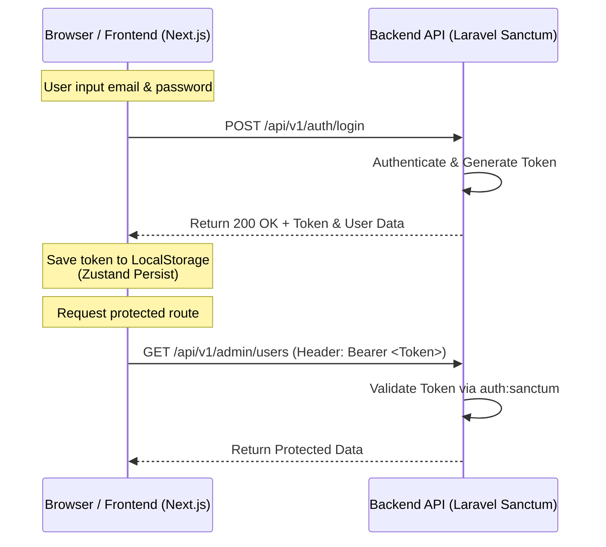

# Analisis Mekanisme Sesi (Auth Session) Frontend-Backend

Dokumen ini memaparkan analisis penanganan sesi (*session management*) yang sedang berjalan di dalam project **AMS (Aditiadika Management System)**, serta memberikan rekomendasi mekanisme sesi terbaik (*best practice*) untuk integrasi aplikasi Single Page Application (SPA) Next.js dengan Laravel API.

---

## 1. Analisis Mekanisme Sesi Saat Ini (Current Implementation)

Saat ini, sistem menggunakan mekanisme **Token-Based Authentication (Stateless)** menggunakan **Laravel Sanctum (Bearer Token)**.



### A. Alur Kerja Frontend (Next.js - Zustand & Axios)
*   **Penyimpanan State:** Frontend menggunakan **Zustand Store** (`useAuthStore`) yang digabungkan dengan middleware `persist` untuk menyimpan data `token`, `user`, dan status `isAuthenticated` langsung ke **`localStorage`** browser dengan kunci `auth-storage`.
*   **Pengiriman Token:** Setiap kali Axios melakukan request, sebuah *Request Interceptor* di `api.ts` akan mengambil token dari `localStorage` dan menyisipkannya ke dalam header `Authorization: Bearer <token>`.
*   **Penanganan Expiry/Unauthorized:** Sebuah *Response Interceptor* di `api.ts` akan mendeteksi jika API mengembalikan status HTTP `401 Unauthorized` (token kedaluwarsa atau tidak valid). Jika terdeteksi, interceptor akan secara otomatis menghapus token dari `localStorage` dan mengalihkan pengguna ke halaman login `/auth/login`.
*   **OAuth (Google Login):** 
    1. Pengguna diarahkan ke `/api/v1/auth/google`.
    2. Backend (Socialite) memproses autentikasi, membuat Sanctum token, dan melakukan redirect balik ke frontend: `/auth/google/callback?token=XYZ`.
    3. Frontend membaca token dari query parameter, menyimpannya ke `localStorage`, dan memanggil endpoint `/auth/me` untuk mendapatkan detail user profile.

### B. Alur Kerja Backend (Laravel Sanctum)
*   **Pembuatan Token:** Laravel menggunakan library bawaan **Sanctum** (`$user->createToken('api-token')->plainTextToken`) untuk membuat token acak berbasis database yang dikaitkan dengan user ID.
*   **Validasi:** Setiap endpoint yang diproteksi menggunakan middleware `auth:sanctum` untuk mencocokkan token di header `Authorization` dengan tabel `personal_access_tokens` di database.
*   **Logout:** Backend mencabut akses token saat ini menggunakan `$request->user()->currentAccessToken()->delete()`.

---

## 2. Kelebihan dan Kekurangan Mekanisme Saat Ini

### Kelebihan (Pros)
1.  **Sederhana & Mudah Diimplementasikan:** Alur Sanctum Bearer Token sangat mudah dikonfigurasi di Laravel maupun SPA Next.js.
2.  **Stateless:** Server backend tidak perlu memelihara file sesi lokal, memudahkan replikasi server (horizontal scaling).
3.  **Dukungan Multi-Platform:** Token JWT atau Sanctum dapat digunakan langsung oleh aplikasi mobile (Android/iOS) jika nantinya dikembangkan.

### Kekurangan & Risiko Keamanan (Cons)
1.  **Kerentanan terhadap XSS (Cross-Site Scripting):** Token disimpan langsung di `localStorage`. Jika ada script berbahaya (dari library pihak ketiga atau input yang kurang ter-sanitize) berhasil dieksekusi di browser, penyerang dapat langsung membaca token tersebut.
2.  **Kurang Aman dari Sisi CSRF jika cookie diaktifkan:** Meskipun stateless token kebal terhadap CSRF secara alami (karena browser tidak mengirimkan header Authorization secara otomatis), penyimpanan token di `localStorage` tetap memiliki risiko XSS yang lebih tinggi dibanding Cookie HttpOnly.

---

## 3. Best Practice Mekanisme Sesi Frontend-Backend (SPA)

Untuk meningkatkan keamanan dan kenyamanan pengguna (*user experience*), ada dua standar mekanisme sesi modern yang direkomendasikan:

### Opsi A: HTTP-Only Cookie-Based Session (Laravel Sanctum SPA Authentication) — *Sangat Direkomendasikan untuk Next.js/React yang di-host di domain/subdomain yang sama*

Alih-alih mengirim token Bearer secara eksplisit, otentikasi menggunakan cookie sesi Laravel yang diamankan dengan atribut `HttpOnly`, `Secure`, dan `SameSite`.

#### Alur Kerja:
```
[Frontend SPA]                                             [Backend API]
      |                                                          |
      |------------ 1. GET /sanctum/csrf-cookie ---------------->| (Set CSRF Cookie)
      |<----------- 2. Set-Cookie: XSRF-TOKEN -------------------|
      |                                                          |
      |------------ 3. POST /login (Credentials + CSRF Header)-->| (Verify & Set Session Cookie)
      |<----------- 4. Set-Cookie: laravel_session (HttpOnly) ---|
      |                                                          |
      |------------ 5. GET /api/v1/user ------------------------>| (Browser otomatis kirim cookies)
      |<----------- 6. Return User JSON -------------------------|
```

*   **Keamanan Maksimal:** JavaScript tidak bisa membaca cookie `HttpOnly`, sehingga kebal dari serangan pencurian token lewat **XSS**.
*   **Perlindungan CSRF:** Laravel otomatis memvalidasi header `X-XSRF-TOKEN` untuk mencegah serangan CSRF.

---

### Opsi B: Dual-Token (Access Token + Refresh Token) dengan HttpOnly Cookies

Jika frontend Next.js di-deploy di domain yang sepenuhnya berbeda dari API Backend (sehingga menyulitkan konfigurasi cross-domain cookie SameSite), gunakan kombinasi penyimpanan token:

1.  **Access Token (Umur Pendek - misal 15 Menit):**
    *   Disimpan di memori aplikasi Next.js (bukan `localStorage`).
    *   Dikirim via header `Authorization: Bearer <Access Token>`.
2.  **Refresh Token (Umur Panjang - misal 7 Hari):**
    *   Disimpan di browser menggunakan **HttpOnly Cookie** yang dikirim ke path `/api/v1/auth/refresh`.
    *   Digunakan oleh frontend untuk meminta Access Token baru secara berkala tanpa intervensi user.

---

## 4. Rekomendasi Langkah Peningkatan untuk Project AMS

Jika Anda ingin beralih ke standar keamanan tertinggi menggunakan **HttpOnly Cookies** (Opsi A) dengan Laravel Sanctum, berikut perubahan yang perlu diterapkan:

### Langkah 1: Konfigurasi di Backend Laravel (`apps/api`)
1.  Pada file `.env`, sesuaikan domain agar mendukung cookie sharing:
    ```env
    SESSION_DOMAIN=.domainanda.com
    SANCTUM_STATEFUL_DOMAINS=domainanda.com,web.domainanda.com,localhost:3000
    ```
2.  Pastikan kernel middleware menyertakan middleware Sanctum untuk menjaga state session:
    ```php
    // app/Http/Kernel.php
    'api' => [
        \Laravel\Sanctum\Http\Middleware\EnsureFrontendRequestsAreStateful::class,
        'throttle:api',
        \Illuminate\Routing\Middleware\SubstituteBindings::class,
    ],
    ```

### Langkah 2: Konfigurasi di Frontend Next.js (`apps/web`)
1.  Ubah konfigurasi Axios di `api.ts` agar selalu mengirim kredensial (cookie):
    ```typescript
    export const api: AxiosInstance = axios.create({
      baseURL: `${normalizedApiUrl}/api/v1`,
      withCredentials: true, // WAJIB untuk mengirim/menerima Cookie
    });
    ```
2.  Sebelum mengirim request login, lakukan pemanggilan CSRF cookie Laravel:
    ```typescript
    // Contoh alur login pada useAuthStore
    login: async (credentials) => {
      // 1. Dapatkan CSRF cookie terlebih dahulu
      await axios.get(`${API_URL}/sanctum/csrf-cookie`, { withCredentials: true });
      
      // 2. Lakukan login biasa (Laravel akan menaruh session cookie di browser)
      const response = await apiClient.auth.login(credentials);
      ...
    }
    ```
3.  Hapus penyimpanan `token` dari `localStorage` / Zustand persist karena verifikasi sesi sepenuhnya ditangani oleh cookie browser secara otomatis.
